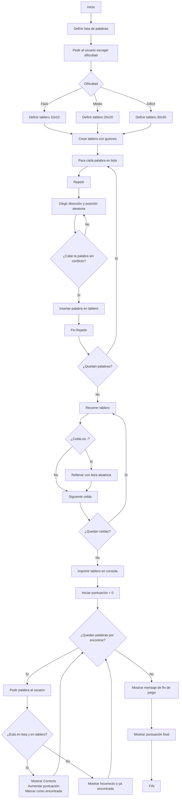

# Sintax-Slayer-Sopa-de-letras ⚔️

### Programacion de computadores

### Universidad Nacional de Colombia

### grupo 7

### Integrantes: 
- Cristian Amezquita
- Sebastian Vega
- Nicolas Valle

# Explicacion de la alternativa ☝️
Nosotros como equipo escogimos la alternativa 1 para entenderla y desarrollarla

La alternativa es: Construir una aplicación que emule una sopa de letras utilizando Python.

#### Para comenzar abordando el problema planteado decidimos desglosarlo y estenderlo por partes más pequeñas para facilitar el trabajo: 


## Qué es una sopa de letras? 🥣
Una sopa de letras es un juego de palabras que consiste en encontrar palabras ocultas dentro de una cuadrícula de letras dispuestas en filas y columnas. Estas palabras pueden estar colocadas en cualquier dirección


## Objetivo: 📌
Desarrollar una aplicación en Python que genere y permita jugar una sopa de letras de tamaño mínimo 10x10 y máximo 30x30, utilizando palabras clave relacionadas con la carrera de Ingeniería Civil, aplicando los conocimientos adquiridos durante el curso de programación.

## Objetivos especificos 📎
- Implementar estructuras de datos adecuadas (listas, matrices) para representar el tablero de la sopa de letras y gestionar el contenido de forma dinámica.

- Aplicar algoritmos de inserción y búsqueda de palabras en distintas direcciones (horizontal, vertical y diagonal), asegurando que estas no se sobrepongan incorrectamente ni excedan los límites de la matriz.

- Automatizar el proceso de generación del tablero, incluyendo la inserción de letras aleatorias en los espacios vacíos para camuflar las palabras ocultas.

- Diseñar una interfaz simple en consola que permita al usuario interactuar con el juego, ingresar palabras, recibir retroalimentación y visualizar el tablero actualizado.

- Integrar un conjunto de palabras relacionadas con Ingeniería Civil, tales como: cimentación, hormigón, estructura, acero, plano, geotecnia, topografía, entre otras, promoviendo así la familiarización con el vocabulario técnico de la profesión.

- Fomentar la reutilización del código mediante el uso de funciones y/o módulos, favoreciendo el desarrollo estructurado, legible y mantenible.

- Incorporar elementos básicos de validación y control de errores, como verificar la validez de palabras ingresadas o el rango del tablero.


## Palabras Clave: 📋

Construir: “Hacer algo utilizando los elementos adecuados.” (RAE, definición 2ª, disponible en: https://dle.rae.es/construir)

Aplicación: “Programa preparado para una utilización específica, como el pago de nóminas, el tratamiento de textos, etc.” (RAE, definición 4ª, disponible en: https://dle.rae.es/aplicación)

Emular: “Imitar las acciones de otro procurando igualarlas e incluso excederlas.” (RAE, definición 1ª, disponible en: https://dle.rae.es/emular)

Sopa de letras: "Pasatiempo consistente en encontrar ciertas palabras dentro de un cuadro compuesto de letras aparentemente desordenadas." (RAE, definición 1ª, disponible en: https://dle.rae.es/sopa)

Python: "Python es un lenguaje de programación interpretado, orientado a objetos y de alto nivel, con semántica dinámica." (Python, disponible en https://www.python.org/doc/essays/blurb/)


## Lluvia de ideas: 💡

#### Decidimos hacer una lluvia de ideas para entender el problema y plantear cómo abordar la solución. Algunas de las ideas fueron: 

### -FUNCIONALIDADES BÁSICAS 🧾
- Generar sopa de letras en consola.

- Insertar palabras en direcciones: horizontal, vertical, diagonal.

- Verificar si una palabra ingresada por el usuario está en la sopa.

- Mostrar la palabra encontrada resaltada (con colores o mayúsculas).

- Limitar número de intentos por palabra.

### POSIBLES MECÁNICAS DE JUEGO 🎮
- Dificultad seleccionable (tamaño de matriz, número de palabras).

- Temporizador para resolver la sopa.

- Puntuación por palabra encontrada.

- Penalización por errores o tiempo.

- Modo contrarreloj o por turnos.

### -ALGORITMOS Y LÓGICA 🔡
- Uso de matrices (listas anidadas) para representar el tablero.

- Búsqueda en 8 direcciones (↔ ↕ ↘ ↙ ↗ ↖).

- Marcar letras usadas para evitar sobreposiciones inválidas.

- Algoritmo que confirme la respuesta correcta.

## MAPA CONCEPTUAL DEL DESARROLLO DEL PROYECTO 📢

```mermaid 
graph TD
    A[Inicio del proyecto] --> B[Lluvia de ideas]
    A --> C[Palabras clave]
    A --> D[Objetivos del proyecto]

    B --> B1[Funcionalidades básicas]
    B --> B2[Diseño de interfaz]
    B --> B3[Algoritmos necesarios]
    B --> B4[Aplicaciones educativas]
    B --> B5[Ampliaciones futuras]

    C --> C1[Construir: hacer algo con elementos - RAE]
    C --> C2[Aplicación: programa específico - RAE]
    C --> C3[Emular: imitar acciones - RAE]
    C --> C4[Sopa de letras: juego de palabras - RAE/Wikipedia]
    C --> C5[Python: lenguaje interpretado, modular - Wikipedia]

    D --> D1[Objetivo general: crear sopa de letras en Python]
    D --> D2[Objetivos específicos]
    
    D2 --> D2a[Usar estructuras de datos]
    D2 --> D2b[Aplicar algoritmos de inserción/búsqueda]
    D2 --> D2c[Automatizar generación del tablero]
    D2 --> D2d[Diseñar interfaz simple]
    D2 --> D2e[Usar vocabulario de Ingeniería Civil]
    D2 --> D2f[Validación de tamaño]
    D2 --> D2g[Reutilización de código]
    D2 --> D2h[Control de errores]

    A --> E[Desarrollo del programa]

    E --> E1[Diseño lógico del sistema]
    E --> E2[Codificación en Python]
    E --> E3[Pruebas y validaciones]
    E --> E4[Optimización y mejoras]
    E --> E5[Documentación del proyecto]

    A --> F[Posibles ampliaciones]

    F --> F1[Interfaz gráfica con Tkinter o Pygame]
    F --> F2[Sopa de letras con pistas o temas]
    F --> F3[Exportar a imagen o PDF]
    F --> F4[Ranking o puntuación]
    F --> F5[Versión web o app móvil]
```


## Pseudo Código 🪢
```
INICIO

  // 1. INICIO
  DEFINIR lista_palabras ← ["hormigon", "cimentacion", "topografia", "estructura", "puente", "acero", "viga", "columna", "plano", "geotecnia"]
  PEDIR al usuario escoger la dificultad (Difícil, medio, facil)
  SI la dificultad es facil: 10x10
  SI la dificultad es medio: 20x20
  SI la dificultad es difícil: 30x30
   
  FIN SI

  CREAR tablero ← matriz vacía de tamaño (filas x columnas) con guiones (-)

  // 2. INSERTAR PALABRAS EN EL TABLERO
  PARA cada palabra EN lista_palabras HACER
    REPETIR
      ELEGIR dirección aleatoria (horizontal, vertical, diagonal)
      ELEGIR posición inicial aleatoria dentro del tablero
      SI cabe la palabra en esa dirección y no hay conflicto
        INSERTAR la palabra en el tablero
        salir del bucle REPETIR
      FIN SI
    HASTA que se inserte correctamente
  FIN PARA

  // 3. LLENAR LOS ESPACIOS VACÍOS CON LETRAS ALEATORIAS
  PARA cada fila del tablero
    PARA cada columna
      SI la celda contiene "-"
        RELLENAR con una letra aleatoria de A-Z
      FIN SI
    FIN PARA
  FIN PARA

  // 4. MOSTRAR EL TABLERO AL USUARIO
  IMPRIMIR tablero en la consola

  // 5. FASE DE JUEGO: BUSCAR PALABRAS
  INICIAR puntuación ← 0
  MIENTRAS haya palabras por encontrar
    PEDIR al usuario una palabra encontrada
    SI la palabra está en la lista y ya fue insertada en el tablero
      MOSTRAR "Correcto"
      AUMENTAR puntuación
      MARCAR palabra como encontrada
    SINO
      MOSTRAR "Incorrecto o ya encontrada"
    FIN SI
  FIN MIENTRAS

  // 6. FINAL DEL JUEGO
  MOSTRAR mensaje de fin de juego
  MOSTRAR puntuación final

FIN
```

# Diagrama de flujo 🖋️

